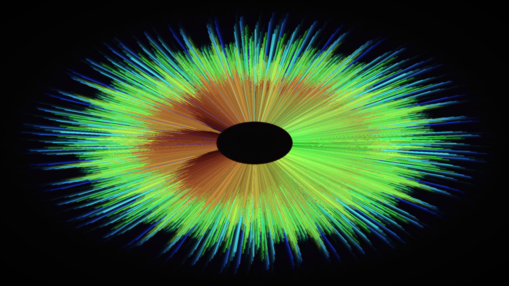

# Audio Visualiser

An audio visualiser for Linux that runs as a live desktop wallpaper on X11. My motivation was to have my own custom live wallpaper that reacts to system sounds and music with beautiful visualisations.

## Requirements

- Linux with PipeWire
- X11 or XWayland (tested on KDE Plasma under Wayland)
- glfw
- glew
- OpenGL

## Features
- 0 heap allocations
- Lock free SPSC ring buffer
- Custom FFT
- Cycles between 5 visual modes dynamically or by pressing "m"
- Runs as a desktop wallpaper on X11 and XWayland

## How it works

1. PipeWire audio thread sends data onto ring buffer
2. Rendering thread pops off latest 4096 samples
3. Hann window function is applied to the samples
4. FFT is applied to the samples, resulting in a 2049 bin spectrum
5. Smoothing is applied to the spectrum, using an exponential moving average
6. OpenGL renders visualisations, applying gaussian bloom pass and chromatic aberration
7. Runs as a desktop wallpaper using EMWH. On KDE Plasma it runs through XWayland.
